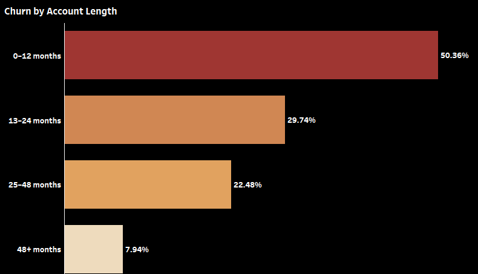

# Customer Churn Analysis

# 📊 Customer Churn Analysis Dashboard (Tableau)
## Project Title
## Customer Churn Analysis (Telecom Industry)
________________________________________
# Business Problem
Customer churn poses a major threat to revenue stability and long-term business sustainability in the telecom industry. 

The organization is experiencing increasing customer attrition and lacks clear insight into why customers are leaving, which segments are most affected, and what actions can reduce churn.

This project was designed to identify churn drivers, high-risk customer segments, and actionable retention opportunities using data analytics and visualization.

*Overall, predict behavior to retain customers. You can analyze all relevant customer data and develop focused customer retention programs.*
________________________________________
# Data
The dataset contains customer-level records some of which includes:
*Customer ID', 'Churn Label', 'Account Length (in months)', 'Local Calls', 'Local Mins', 'Intl Calls', 'Intl Mins', 'Intl Active', 'Intl Plan', 'Extra International Charges', 'Customer Service Calls', 'Avg Monthly GB Download', 'Unlimited Data Plan', 'Extra Data Charges', 'State', 'Phone Number', 'Gender', 'Age', 'Under 30', 'Senior', 'Group', 'Number of Customers in Group', 'Device Protection & Online Backup', 'Contract Type', 'Payment Method', 'Monthly Charge', 'Total Charges', 'Churn Category', 'Churn Reason*

________________________________________
# Approach
The project followed a structured analytical workflow:
1.	Data understanding and cleaning
2.	KPI identification and metric definition
3.	Segmentation analysis
4.	Visual analytics and dashboard design
5.	Insight extraction and business interpretation
Interactive dashboards were built in Tableau to allow dynamic filtering and drill-down analysis across multiple customer dimensions.
________________________________________
# Problem Statement
How can customer churn be reduced by identifying key behavioral, contractual, and demographic factors influencing customer attrition? i.e predict behaviour that are common to customers who churn and common behaviour amongs those who does not churn
________________________________________
# Objectives
+ Identify patterns that distinguish churned customers from retained customers across behavioural, contractual, demographic dimensions, and use these patterns to then predict churn risk and guide retention and actions

________________________________________
# Data sanity check
+ duplicates using COUNT and COUNTD on the CUSTOMERS ID 

________________________________________
# Questions Answered
+	Which customer segments have the highest churn rates?
+	How does contract type affect churn behavior?
+	What payment methods are associated with higher churn?
+	How does customer tenure influence churn probability?
+	Which customer groups represent the highest retention risk?
________________________________________
# Metrics Used
+	Churn Rate (%)
+	Customer Retention Rate
+	Average Tenure
+	Customer Count
+	Revenue Contribution
+	Contract Distribution
+	Payment Method Distribution
________________________________________

# FINDINGS AND INSIGHTS

# Dashboard Link
📍 Tableau Public:
The full interactive dashboard can be viewed on [Customer Churn Analysis] (https://public.tableau.com/app/profile/godwin.jnr.okoko/viz/Book1_17702020568040/High-RiskGroups?publish=yes) 
________________________________________
# Key Insights
## Contract Type is the Strongest predictor of Churn
    Customers on month-to-month contracts show a significantly higher churn rate compared to those on one-year and two-year contracts.

    Encourage customers to migrate from month-to-month to a longer-term contracts; this can significantly reduce churn

## Payment Method also influcences churn beaviour
    Customers using electronic check payment experiences higher churn rates than those using automatic transfer or credits cards

    This could be as a result fo the fact that manual payments method has lower engagement and higher friction
    Automatic paying customers tend to be more stable
  
    Encouraguing auto-matic payment adoption for services can improve retention and revenue increase

## Customer Tenure
    From the visualization of churn rate by account lengths, It can be seeing that customers with shorter renure or length of account between 0 to 12 months churn at a much higher rate than long_tenure customers.

    These likely points to the fact that early experience determines a long term retention showing that onboarding quality is critical and crucial

    Having targeted onboarding experience, welcoming offers in the first year stands the chance to reduce early churns

________________________________________
# Business Recommendations

________________________________________
Tools & Technologies
•	Tableau – Data visualization and dashboard development
•	Excel / CSV – Data preprocessing
•	GitHub – Project documentation and portfolio hosting
________________________________________
Project Purpose
This project demonstrates the application of data analytics for business decision-making, using visualization to translate raw data into actionable insights. It reflects real-world analytical workflows used in customer analytics, business intelligence, and strategic decision support systems.
________________________________________
Author
Godwin-Junior Okoko
Data Analyst | BI Developer | Analytical Chemical Engineer
________________________________________
Folder Structure Example
Project_1_Customer_Churn/
│
├── dataset.csv
├── project_description.md
├── screenshots/
│   ├── dashboard_overview.png
│   ├── churn_by_contract.png
│   └── churn_by_payment.png
└── tableau_public_link.txt

